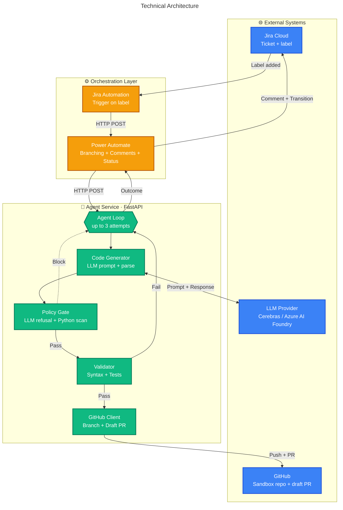
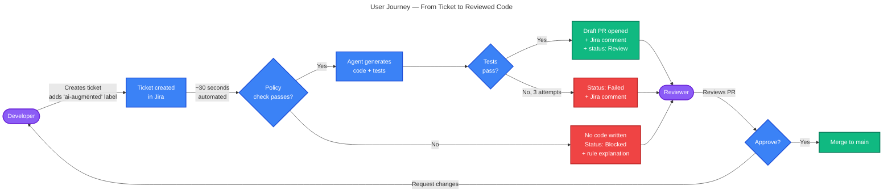

Almost — but you've got **nested fences** which break Markdown rendering on GitHub. You have ` ```` ` (4 backticks) wrapping ` ``` ` (3 backticks). Most renderers see this as broken.

## Clean version — use this in your README

## Schema 1 — Technical Architecture



## Schema 2 — User Journey


